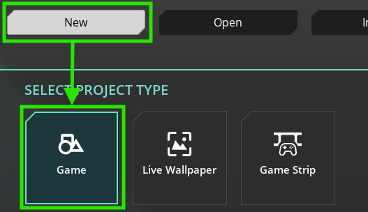

# Shape Shooter

Let's create your own version of "Asteroids" in :simple-gamemaker: GameMaker Studio

---

## Briefing

We are going to create this game in three simple steps:

1. Making the player (ship) move
2. Make the asteroids explode
3. Finishing touches

---

## Step 1: Creating a New Project

Open :simple-gamemaker: GameMaker Studio and click on the "New" button

You can select a template here, but we're going to create a blank project.

Enter a name for your project (I went for "ShapeShooter"), and hit "Let's Go!"

---

## Step 2: Making Some Art

Before we can write any code, we need to make some art for the player, and the shapes we're gonna shoot.
