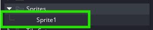
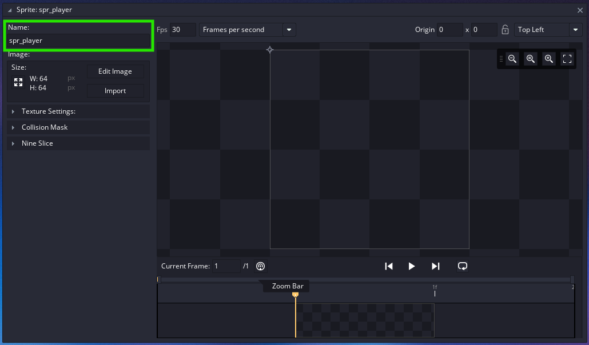
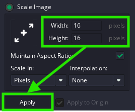
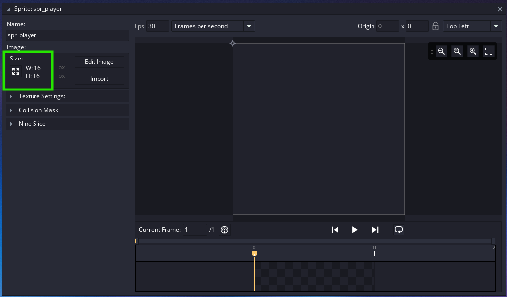
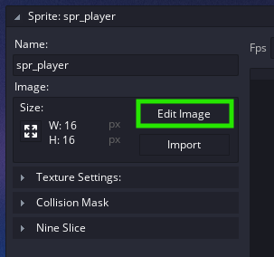
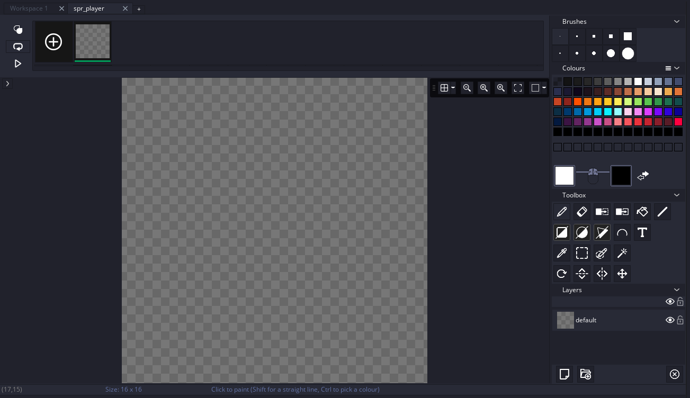
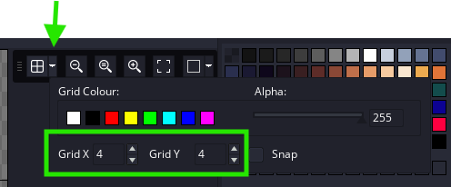
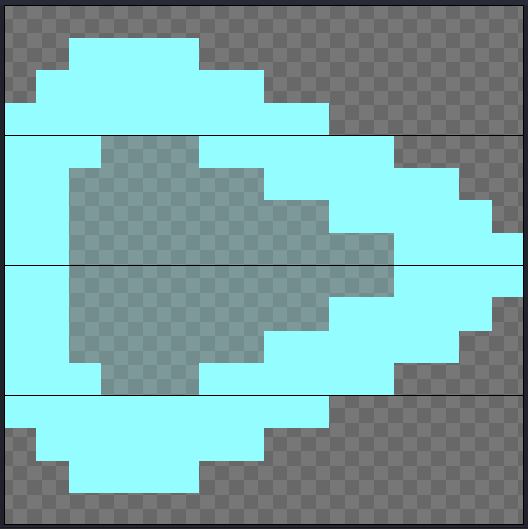
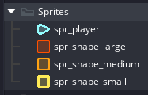

# Shape Shooter

Let's create your own version of "Asteroids" in :simple-gamemaker: GameMaker Studio

---

## Briefing

We are going to create this game in three simple steps:

1. Making the player (ship) move
2. Make the asteroids explode
3. Finishing touches

---

## Step 1: Creating a New Project

Open :simple-gamemaker: GameMaker Studio and click on the "New" button

/// caption
You can select a template here, but we're going to create a blank project.
///

Enter a name for your project (I went for "ShapeShooter"), and hit "Let's Go!"

/// caption
You can also set the path to your project here.
For this tutorial, you don't need to, but you can if you want to.
///

---

## Step 2: Making Some Basic Art

Before we can write any code, we need to make some art for the player, and the shapes we're gonna shoot.

### Creating Sprites

Right-click on the "sprites" folder in the Asset Browser on the left side of the screen.
Then select "Create > Sprite"

/// caption
Creating a sprite
///

Now you should have a new Sprite!

/// caption
The Sprite Editor
///

/// caption
The sprite in the Asset Browser
///

### Renaming Sprites

Let's name our sprite "spr_player". You can rename your sprite by clicking the box in the top-left of it's window,
or by double-clicking on the item in the Asset Browser

!!! tip

    It is recommended to follow :simple-gamemaker: GameMaker Studio's naming guidelines.
    Sprite names should *always* begin with "spr_" to signify that it is a sprite.
    This becomes extremely handy when using auto-complete while writing code, as all the sprites will be grouped together.

/// caption
Our renamed sprite
///

### Resizing Sprites

Before we jump into making the sprite, lets quickly resize our canvas size.
64 x 64 pixels is a bit big for our use case today.

Click on the :material-arrow-expand-all: icon on the left-hand side of the sprite editor, and adjust the values to 16 x 16 pixels.

/// caption
Here we can see the current size of the sprite.
Lets click the button and resize it.
///

/// caption
Set the width and height values to 16, and click "Apply".

If "Maintain Aspect Ratio" is checked, you will only have to change one of the values.
The other should follow suit.
///

///caption
Now our sprite is resized
///

Now we can create our player sprite!

### The Sprite Editor

Click on the "Edit Image" button on the left-hand side to open the Sprite Editor.

/// caption
Open the Sprite Editor using the "Edit Image" button
///

/// caption
The Sprite Editor :eye::mouth::eye:
///

!!! quote annotate inline end

    If you get the reference, you get a cookie! 🍪 (1)

1.  Here's a hint: You gotta think with *Portals...*

Now, don't be alarmed, alright?
Although, if you do feel alarm, try to hold onto that feeling because that is the proper reaction to being told you have brain damage...

...or using the :simple-gamemaker: GameMaker Studio Sprite Editor...

In all seriousness, it's not as bad as it looks.

#### The :material-grid-large: Grid Overlay

To make drawing symmetrical shapes easier, lets enable the grid overlay.
Simply click on the :material-grid-large: button to enable the grid, and use the drop-down menu to customise.

/// caption
16 (sprite size) / 4 (grid size) = 4 (grid size in pixels)
///

#### Common Tools

| Tool                                | Description                                               | Shortcut |
| ----------------------------------- | --------------------------------------------------------- | -------- |
| :material-pencil: Paintbrush        | Draw freely                                               | `D`      |
| :material-eraser: Erase             | Erase pixels back to transparent                          | `E`      |
| :material-format-color-fill: Fill   | Fill the selected area with colour                        | `F`      |
| :material-vector-line: Line         | Draws a line between 2 points                             | `L`      |
| :material-square-outline: Rectangle | Draws an outlined or filled rectangle                     | `R`      |
| :material-circle-outline: Ellipse   | Draws an outlined or filled ellipse                       | `C`      |
| :material-triangle-outline: Polygon | Draws an outlined or filled polygon with the given points | `P`      |
| :material-eyedropper: Colour Picker | Selects the colour of the selected pixel                  | `O`      |

### The Player

For the player, I used a few line segments to create a simple, triangular design.

/// caption
"Here's one I made earlier :woman_tipping_hand:" ahh sprite
///

!!! note

    For a reason that is *far* above my pay grade, :simple-gamemaker: GameMaker Studio has 0^o^ facing toward the left, instead of upwards.
    This means you have to draw your sprites facing to the left if they are in a top-down perspective, like here.

### Creating the Rest

Now that we have our player, we can create the shapes we are going to shoot.
Follow the same process as before to create 3 different sized shapes.
Feel free to use a different sprite to make your shapes bigger.

/// caption
My 3 Shapes. Small (16x16), Medium (32x32), and Large (64x64)
///

Now we can start writing code!

---

## Step 3: Coding the Player

Lets start creating the player.
To do so, we need to create an Object, and name it "obj_player".

!!! tip

    Just like with sprites, objects follow :simple-gamemaker: GameMaker Studio's naming guidelines.
    Object names should *always* begin with "obj_" to signify that it is an object.
