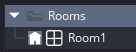
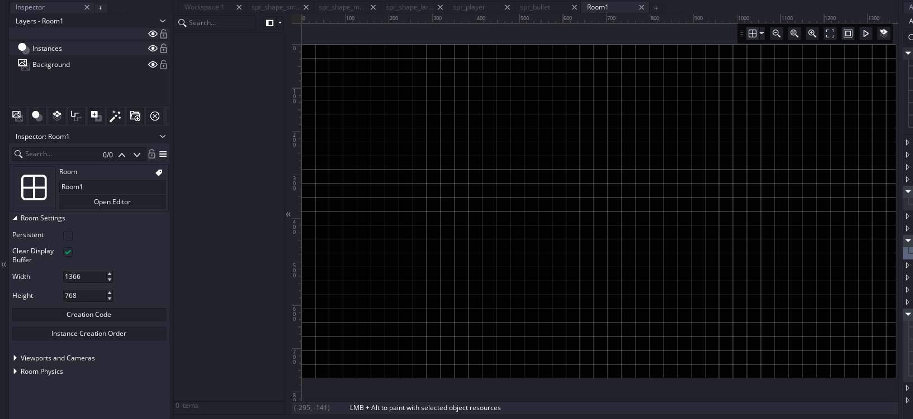

# Step 3: Creating a Room

Rooms are essentially your game's world.
You add things to them, and those things show up on screen.

## (Not) Creating Rooms

New :simple-gamemaker: GameMaker Studio projects come with a room pre-made, so let's use that!
If you need to create one, they are done in the same way sprites are.

/// caption
A free room? In this economy?
///

/// caption
This is the Room Editor.
Do not panic, it's super simple, I promise!
///

## Resizing Rooms

Let's resize the room using the inspector panel on the left hand side.
1000x1000 should suffice for our use case.

/// caption
You can resize in the Inspector Panel
///

## Layers

Looking at the left panel again, near the top, you'll notice two layers that are created by default.

-   "Background": This is a background layer and it's the background (duh).
    Usually a colour or an image.

-   "Instances": This is an instance layer. This is where your object live.

Click on the "Instances" layer to select it, and then drag your player object into the room.

/// caption
We've now placed an "instance" of our player object into the room
///

Let's do the same for the obj_shape we created, but a couple more times.

/// caption
6 Shape objects in the room. pretty big huh?
///

Now if you run the game
(by pressing F5, or by pressing the :material-play-outline:{ .lg .middle }button at the top of the screen)
the game will open, but nothing moves...

...So let's fix that!